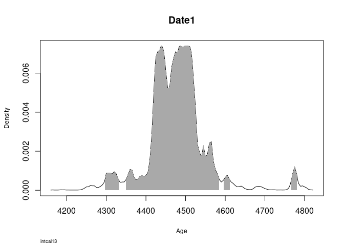
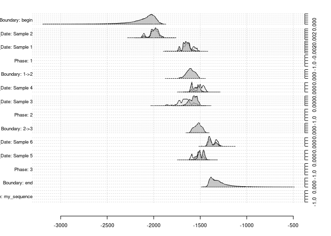

## Basic Calibration in R
### Available Options

* [ArchaeoPhases](https://cran.rstudio.com/web/packages/ArchaeoPhases/index.html)
  *  Marie-Anne Vibet
  * "Post-Processing of the Markov Chain Simulated by 'ChronoModel', 'Oxcal' or 'BCal'"
  * Not really for calibration itself, has to be done externally
* [ArchSeries](https://github.com/davidcorton/archSeries)
  *  David Orton
  * "Frequency time-series tools for archaeology"
  * No calibration options
  * Not on CRAN yet
* [Bchron](http://cran.rstudio.com/web/packages/Bchron/index.html)
  *  Andrew Parnell
  * "A Bayesian radiocarbon chronology model with R"
  * BchronCalibrate()
* [rcarbon](https://cran.r-project.org/web/packages/rcarbon/index.html)
  *  Andrew Bevan
  * "Calibration and Analysis of Radiocarbon Dates"
  * calibrate()
* [oxcAAR](https://cran.r-project.org/web/packages/oxcAAR/index.html)
  *  ISAAK
  * "Interface to 'OxCal' Radiocarbon Calibration"
  * oxcalCalibrate()
* Hand made (it is actually not that hard)
  * Basic
  * by means of matrix algebra (see [my blog post on basic calibration](http://martinhinz.info/jekyll/update/blog/2016/06/03/simple_calibration.html)) 
  * by means of bayesian statistics (see [my blog post on bayesian calibration](http://martinhinz.info/jekyll/update/blog/2017/01/23/bayesian_calibration.html))

Essentially it is Bchron, rcarbon and oxcAAR!

## Installing the packages with calibration option

So lets start with them and install them if necessary


```r
# currently installing the additional_oxcal_commands branch from github
library(devtools)

devtools::install_github('MartinHinz/oxcAAR', ref="additional_oxcal_commands")
```

```
## Skipping install of 'oxcAAR' from a github remote, the SHA1 (ac48fe91) has not changed since last install.
##   Use `force = TRUE` to force installation
```

```r
# A bit of magick
# I added dplyer because we might need it later
package_list <- c("Bchron", "rcarbon", "oxcAAR", "dplyr") # The packages we would like to have

for (package in package_list){ # for each in the list
  if( !is.element(package, .packages(all.available = TRUE)) ) { #check if it is not already installed
    install.packages(package, repos = "http://cran.us.r-project.org") # if not, install it
  }
  library(package,character.only = TRUE) # load package
}
```

```
## 
## Attaching package: 'dplyr'
```

```
## The following objects are masked from 'package:stats':
## 
##     filter, lag
```

```
## The following objects are masked from 'package:base':
## 
##     intersect, setdiff, setequal, union
```

Luckily, all calibration functions are named differently, so there is no overwriting of the functions going on here. Only dplyr is masking some functions, but this should not bother us. We can have all of them side by side.

## Just doing calibration

We might be eager to do our first calibration, so lets start immediatly. We need a 14C date for that, consisting of BP uncal and BP standard deviation:


```r
bp <- 4000
std <- 50
```

With that at hand, we can start calibration:

### rcarbon

Here it is straight forward, just plug in your date and let it run


```r
calDate.rcarbon <- calibrate(bp,std)
```

```
## [1] "Done."
```

```r
str(calDate.rcarbon)
```

```
## List of 3
##  $ metadata :'data.frame':	1 obs. of  11 variables:
##   ..$ DateID    : chr "1"
##   ..$ CRA       : num 4000
##   ..$ Error     : num 50
##   ..$ Details   : logi NA
##   ..$ CalCurve  : chr "intcal13"
##   ..$ ResOffsets: num 0
##   ..$ ResErrors : num 0
##   ..$ StartBP   : num 50000
##   ..$ EndBP     : num 0
##   ..$ Normalised: logi TRUE
##   ..$ CalEPS    : num 1e-05
##  $ grids    :List of 1
##   ..$ 1:Classes 'calGrid' and 'data.frame':	624 obs. of  2 variables:
##   .. ..$ calBP : num [1:624] 4821 4820 4819 4818 4817 ...
##   .. ..$ PrDens: num [1:624] 1.13e-05 1.47e-05 1.60e-05 1.74e-05 1.89e-05 ...
##  $ calmatrix: logi NA
##  - attr(*, "class")= chr [1:2] "CalDates" "list"
```

The result is a list containing
* $metadata: The metadata for the (uncalibrated) date
* $grids: The actual calibrated probabilities
* $calmatrix: A matrix of probability values, one row per calendar year (BP!) in timeRange and one column per date. Just a different format of $grids. This defaults to NA if not `calMatrix=TRUE` is specified in the call.

So let's plot it 

```r
plot(calDate.rcarbon)
```

<!-- -->

Nice and clean!

### Bchron

Again straight forward, specify BP, std and (here necessary, in rcarbon optional) the calibration curve


```r
calDate.Bchron <- BchronCalibrate(ages = bp, ageSds = std, calCurves = "intcal13")
str(calDate.Bchron)
```

```
## List of 1
##  $ Date1:List of 5
##   ..$ ages     : num 4000
##   ..$ ageSds   : num 50
##   ..$ calCurves: chr "intcal13"
##   ..$ ageGrid  : num [1:625] 4160 4161 4162 4163 4164 ...
##   ..$ densities: num [1:625] 1.03e-05 1.14e-05 1.26e-05 1.40e-05 1.55e-05 ...
##  - attr(*, "class")= chr "BchronCalibratedDates"
```

The result is a list containing
* $ages: The uncalibrated date
* $ageSds: The standard deviation of the uncalibrated date
* $calCurves: The calibration curve used
[We have specified this as input parameters]
* $ageGrid: The calibrated BP (!) values
* $densities: The calibrated probabilities

So let's plot it 


```r
plot(calDate.Bchron)
```

<!-- -->

Also nice, lacking the uncal probability and the calibration curve, but highlighting the 95% highest density region (2 sigma range). Note that time is running here from right to left (BP dates).

### oxcAAR

oxcAAR needs a bit of extra love before it works. It relies on OxCal as calibration backend, so we have to install it first. Luckily there is a helper for doing that:


```r
quickSetupOxcal()
```

```
## Oxcal doesn't seem to be installed. Downloading it now:
```

```
## Oxcal download to /tmp/Rtmpab9DRR successful!
```

```
## Oxcal path set!
```

```
## NULL
```

Oxcal is installed in your working directory, and the path to the executable is set. With that we might proceed to the calibration:


```r
calDate.oxcAAR <- oxcalCalibrate(bp, std)
str(calDate.oxcAAR)
```

```
## List of 1
##  $ 1:List of 6
##   ..$ name             : chr "1"
##   ..$ bp               : int 4000
##   ..$ std              : int 50
##   ..$ cal_curve        :List of 5
##   .. ..$ name      : chr " IntCal13 atmospheric curve (Reimer et al 2013)"
##   .. ..$ resolution: num 5
##   .. ..$ bp        : num [1:10001] 46401 46396 46391 46386 46381 ...
##   .. ..$ bc        : num [1:10001] -48050 -48044 -48040 -48034 -48030 ...
##   .. ..$ sigma     : num [1:10001] 274 274 274 273 273 ...
##   ..$ sigma_ranges     :List of 3
##   .. ..$ one_sigma  :'data.frame':	1 obs. of  3 variables:
##   .. .. ..$ start      : num -2572
##   .. .. ..$ end        : num -2468
##   .. .. ..$ probability: num 68.2
##   .. ..$ two_sigma  :'data.frame':	3 obs. of  3 variables:
##   .. .. ..$ start      : num [1:3] -2834 -2665 -2384
##   .. .. ..$ end        : num [1:3] -2815 -2395 -2344
##   .. .. ..$ probability: num [1:3] 1.7 90.5 3.2
##   .. ..$ three_sigma:'data.frame':	3 obs. of  3 variables:
##   .. .. ..$ start      : num [1:3] -2860 -2756 -2704
##   .. .. ..$ end        : num [1:3] -2805 -2716 -2290
##   .. .. ..$ probability: num [1:3] 2.5 0.6 96.6
##   ..$ raw_probabilities:'data.frame':	158 obs. of  2 variables:
##   .. ..$ dates        : num [1:158] -2910 -2904 -2900 -2894 -2890 ...
##   .. ..$ probabilities: num [1:158] 0.00 0.00 0.00 7.19e-09 3.59e-08 ...
##   ..- attr(*, "class")= chr "oxcAARCalibratedDate"
##  - attr(*, "class")= chr [1:2] "list" "oxcAARCalibratedDatesList"
```

The resulting object is a bit more complicated. It is a list of calibrated dates (one each for each uncalibrated date inserted in the call), each containing

* $name: A name for the date. If not given, a consecutive number.
* $bp, $std: The uncalibrated date and its standard deviation
[We have specified this as input parameters]
* $cal_curve: The calibration curve used, with full parameterisation. Defaults to intcal13
* $sigma_ranges: The sigma ranges for the calibrated date (1,2,3 sigma)
* $raw_probabilities: a data frame containing the BC (!) dates and the calibrated probabilities

Again, let's plot it 


```r
plot(calDate.oxcAAR)
```

<!-- -->

Sigma ranges, probabilities, everything is in there.

Want a calibration curve?


```r
calcurve_plot(calDate.oxcAAR)
```

<!-- -->

### Multiple dates

So, if you like to calibrate multiple dates, that is also not hard:


```r
calMultiDate.rcarbon <- calibrate(x = c(4000,3000), errors = c(50,25) )
```

```
## [1] "Calibrating radiocarbon ages..."
## 
  |                                                                       
  |                                                                 |   0%
  |                                                                       
  |=================================================================| 100%
## [1] "Done."
```

```r
str(calMultiDate.rcarbon)
```

```
## List of 3
##  $ metadata :'data.frame':	2 obs. of  11 variables:
##   ..$ DateID    : chr [1:2] "1" "2"
##   ..$ CRA       : num [1:2] 4000 3000
##   ..$ Error     : num [1:2] 50 25
##   ..$ Details   : logi [1:2] NA NA
##   ..$ CalCurve  : chr [1:2] "intcal13" "intcal13"
##   ..$ ResOffsets: num [1:2] 0 0
##   ..$ ResErrors : num [1:2] 0 0
##   ..$ StartBP   : num [1:2] 50000 50000
##   ..$ EndBP     : num [1:2] 0 0
##   ..$ Normalised: logi [1:2] TRUE TRUE
##   ..$ CalEPS    : num [1:2] 1e-05 1e-05
##  $ grids    :List of 2
##   ..$ 1:Classes 'calGrid' and 'data.frame':	624 obs. of  2 variables:
##   .. ..$ calBP : num [1:624] 4821 4820 4819 4818 4817 ...
##   .. ..$ PrDens: num [1:624] 1.13e-05 1.47e-05 1.60e-05 1.74e-05 1.89e-05 ...
##   ..$ 2:Classes 'calGrid' and 'data.frame':	352 obs. of  2 variables:
##   .. ..$ calBP : num [1:352] 3354 3353 3352 3351 3350 ...
##   .. ..$ PrDens: num [1:352] 1.01e-05 1.15e-05 1.31e-05 1.49e-05 1.69e-05 ...
##  $ calmatrix: logi NA
##  - attr(*, "class")= chr [1:2] "CalDates" "list"
```

```r
calMultiDate.Bchron <- BchronCalibrate(ages = c(4000,3000), ageSds = c(50,25), calCurves = c("intcal13","intcal13"))
str(calMultiDate.Bchron)
```

```
## List of 2
##  $ Date1:List of 5
##   ..$ ages     : num 4000
##   ..$ ageSds   : num 50
##   ..$ calCurves: chr "intcal13"
##   ..$ ageGrid  : num [1:625] 4160 4161 4162 4163 4164 ...
##   ..$ densities: num [1:625] 1.03e-05 1.14e-05 1.26e-05 1.40e-05 1.55e-05 ...
##  $ Date2:List of 5
##   ..$ ages     : num 3000
##   ..$ ageSds   : num 25
##   ..$ calCurves: chr "intcal13"
##   ..$ ageGrid  : num [1:303] 3010 3036 3037 3038 3039 ...
##   ..$ densities: num [1:303] 1.08e-05 1.03e-05 1.11e-05 1.21e-05 1.31e-05 ...
##  - attr(*, "class")= chr "BchronCalibratedDates"
```

```r
calMultiDate.oxcAAR <- oxcalCalibrate(bp = c(4000,3000), std = c(50,25))
str(calMultiDate.oxcAAR)
```

```
## List of 2
##  $ 1:List of 6
##   ..$ name             : chr "1"
##   ..$ bp               : int 4000
##   ..$ std              : int 50
##   ..$ cal_curve        :List of 5
##   .. ..$ name      : chr " IntCal13 atmospheric curve (Reimer et al 2013)"
##   .. ..$ resolution: num 5
##   .. ..$ bp        : num [1:10001] 46401 46396 46391 46386 46381 ...
##   .. ..$ bc        : num [1:10001] -48050 -48044 -48040 -48034 -48030 ...
##   .. ..$ sigma     : num [1:10001] 274 274 274 273 273 ...
##   ..$ sigma_ranges     :List of 3
##   .. ..$ one_sigma  :'data.frame':	1 obs. of  3 variables:
##   .. .. ..$ start      : num -2572
##   .. .. ..$ end        : num -2468
##   .. .. ..$ probability: num 68.2
##   .. ..$ two_sigma  :'data.frame':	3 obs. of  3 variables:
##   .. .. ..$ start      : num [1:3] -2834 -2665 -2384
##   .. .. ..$ end        : num [1:3] -2815 -2395 -2344
##   .. .. ..$ probability: num [1:3] 1.7 90.5 3.2
##   .. ..$ three_sigma:'data.frame':	3 obs. of  3 variables:
##   .. .. ..$ start      : num [1:3] -2860 -2756 -2704
##   .. .. ..$ end        : num [1:3] -2805 -2716 -2290
##   .. .. ..$ probability: num [1:3] 2.5 0.6 96.6
##   ..$ raw_probabilities:'data.frame':	158 obs. of  2 variables:
##   .. ..$ dates        : num [1:158] -2910 -2904 -2900 -2894 -2890 ...
##   .. ..$ probabilities: num [1:158] 0.00 0.00 0.00 7.19e-09 3.59e-08 ...
##   ..- attr(*, "class")= chr "oxcAARCalibratedDate"
##  $ 2:List of 6
##   ..$ name             : chr "2"
##   ..$ bp               : int 3000
##   ..$ std              : int 25
##   ..$ cal_curve        :List of 5
##   .. ..$ name      : chr " IntCal13 atmospheric curve (Reimer et al 2013)"
##   .. ..$ resolution: num 5
##   .. ..$ bp        : num [1:10001] 46401 46396 46391 46386 46381 ...
##   .. ..$ bc        : num [1:10001] -48050 -48044 -48040 -48034 -48030 ...
##   .. ..$ sigma     : num [1:10001] 274 274 274 273 273 ...
##   ..$ sigma_ranges     :List of 3
##   .. ..$ one_sigma  :'data.frame':	3 obs. of  3 variables:
##   .. .. ..$ start      : num [1:3] -1278 -1200 -1137
##   .. .. ..$ end        : num [1:3] -1206 -1194 -1134
##   .. .. ..$ probability: num [1:3] 64.4 2.2 1.7
##   .. ..$ two_sigma  :'data.frame':	3 obs. of  3 variables:
##   .. .. ..$ start      : num [1:3] -1373 -1299 -1146
##   .. .. ..$ end        : num [1:3] -1354 -1154 -1126
##   .. .. ..$ probability: num [1:3] 3.6 85.6 6.2
##   .. ..$ three_sigma:'data.frame':	2 obs. of  3 variables:
##   .. .. ..$ start      : num [1:2] -1390 -1319
##   .. .. ..$ end        : num [1:2] -1336 -1112
##   .. .. ..$ probability: num [1:2] 5.5 94.2
##   ..$ raw_probabilities:'data.frame':	90 obs. of  2 variables:
##   .. ..$ dates        : num [1:90] -1440 -1434 -1430 -1424 -1420 ...
##   .. ..$ probabilities: num [1:90] 0.00 0.00 0.00 3.43e-08 6.87e-08 ...
##   ..- attr(*, "class")= chr "oxcAARCalibratedDate"
##  - attr(*, "class")= chr [1:2] "list" "oxcAARCalibratedDatesList"
```

In case of Bchron, for every date a calibration curve must be given independently. Can be a bit tedious, but one can script that, too.

The result is all the same like when calibrating an individual date, but in every case two results are produce, one for each uncalibrated date. In case of rcarbon, the dates are internally separated, in case of Bchron and oxcAAR, the result is simply is list of calibrated dates. 

How are multiple dates visualised in each package?


```r
plot(calMultiDate.rcarbon)
```

<!-- -->

```r
plot(calMultiDate.Bchron)
```

<!-- --><!-- -->

```r
plot(calMultiDate.oxcAAR)
```

<!-- -->

In case of Bchron there is an individual plot for each date, with oxcAAR both dates are plotted on the same x-axis (time), while rcarbon only returns the first date. With an additional parameter you can convince rcarbon to plot the second date, but all the time only one date per plot.


```r
plot(calMultiDate.rcarbon, ind = 2)
```

<!-- -->

## Why oxcAAR?

### Differences between calibration algorithms

In archaeology, OxCal has become a quasi standard for calibration. One might like that or not, but to make results comparable it is actually not bad to agree on a standard. Calibration itself is not a hard thing to do (we will see that later), but the results of the different implementations might vary. Lets compare (in doing so we shift the dates from oxcAAR by 1950 to make them BP and add 0.5 due to the specific output values of OxCal):

<!-- -->

While rcarbon and oxcAAR are quite similar (based on the same algorithm, although OxCal works on 5 years resolution), Bchron results differ.

If we zoom in and just look at the differences:

<!-- -->

Also rcarbon differs slightly from the implementation in OxCal. This might not mean much, and it does not imply that OxCal is actually the correct result, but it means that the different algorithm produce slighly different probabilities.

So, if you like to work with results that are exactly like those who are using OxCal, oxcAAR might be the best option. This especially holds true if you later want to do rather esoteric things like sum calibration. Removing every possible source of mistrust might be relevant in this field, still.

### Sequential calibration

What is also possible with oxcAAR (and as it seems, with no other package currently), is using the capabilities of OxCal to produce sequential calibrations. This is an aspect that should be made more accessible in the future, but it is already possible now.

Lets assume we have something like that:


```oxcal
top soil
------------------------
  Phase 3
Sample 6 BP 3100 +- 25
Sample 5 BP 3250 +- 25
------------------------
  Phase 2
Sample 4 BP 3230 +- 25
Sample 3 BP 3370 +- 25
------------------------
  Phase 1
Sample 2 BP 3640 +- 25
Sample 1 BP 3340 +- 25
------------------------
  virgin soil
```

We could represent this in a dataframe like this:

```r
my_sequence <- data.frame(name=character(), phase=numeric(), bp=numeric(), std = numeric(), stringsAsFactors = F)

my_sequence[1,] <- list("Sample 6", 3, 3100, 25)
my_sequence[2,] <- list("Sample 5", 3, 3250, 27)
my_sequence[3,] <- list("Sample 4", 2, 3230, 31)
my_sequence[4,] <- list("Sample 3", 2, 3370, 50)
my_sequence[5,] <- list("Sample 2", 1, 3640, 28)
my_sequence[6,] <- list("Sample 1", 1, 3340, 33)

my_sequence
```

```
##       name phase   bp std
## 1 Sample 6     3 3100  25
## 2 Sample 5     3 3250  27
## 3 Sample 4     2 3230  31
## 4 Sample 3     2 3370  50
## 5 Sample 2     1 3640  28
## 6 Sample 1     1 3340  33
```

In the real world you might have the data already present in a convenient format, like csv data exported from Excel.


```r
# The following code is only necessary if using the CRAN 1.0.0 version of oxcAAR
# You might like to checkout the Github version (currently Branch additional_oxcal_commands)

# Phase <- function(r_dates_strings, names='') {
#   paste("Phase(\"", names, "\"){\n",r_dates_strings,"};", sep = "")
# }
# 
# Boundary <- function(names) {
#   paste("Boundary(\"", names, "\");", sep = "")
# }
# 
# wrap_in_boundaries <- function(phases_strings, boundary_names=NA) {
#   n_phases <- length(phases_strings)
#   if(length(boundary_names)==1) {
#     if(is.na(boundary_names)){
#     boundary_names <- 1:n_phases + 1
#     } else {
#       boundary_names <- rep(boundary_names,n_phases + 1)
#     }
#   }
#   my_result <- character(n_phases*2+1)
#   for(i in 1:n_phases) {
#     my_result[2*i-1] <- Boundary(boundary_names[i])
#     my_result[2*i] <- phases_strings[i]
#   }
#   my_result[length(my_result)] <- Boundary(tail(boundary_names, n=1))
#   return(my_result)
# }
# 
# Sequence <- function(sequence_elements, name='') {
#   paste("Sequence(\"", name, "\")\n{", paste(sequence_elements,collapse="\n"), "};", sep="")
# }
```


```r
test <- by(my_sequence,my_sequence$phase, function(x)
  R_Date(x$name,x$bp,x$std))

phases <- Phase(names=c("1","2","3"), r_dates_strings = test)
boundary_name <- c("begin","1->2","2->3","end")
my_sequence_elements <- wrap_in_boundaries(phases, boundary_name)

my_oxcal_code <- Sequence(my_sequence_elements, name = "my_sequence")
my_result_file <- executeOxcalScript(my_oxcal_code)
my_result_text <- readOxcalOutput(my_result_file)
my_result_data <- parseOxcalOutput(my_result_text)
my_result_data
```

```
## List of 6 calibrated dates:
## 
## 	Sample 2
## BP = 3640, std = 28
## 
##   one sigma: 2033 BC - 1950 BC
##   two sigma: 2130 BC - 1922 BC
## three sigma: 2136 BC - 1895 BC
## 
## Calibrated after:
## 	  IntCal13 atmospheric curve (Reimer et al 2013) 
## 
## 	Sample 1
## BP = 3340, std = 33
## 
##   one sigma: 1684 BC - 1560 BC
##   two sigma: 1730 BC - 1528 BC
## three sigma: 1744 BC - 1504 BC
## 
## Calibrated after:
## 	  IntCal13 atmospheric curve (Reimer et al 2013) 
## 
## 	Sample 4
## BP = 3230, std = 31
## 
##   one sigma: 1526 BC - 1449 BC
##   two sigma: 1606 BC - 1430 BC
## three sigma: 1615 BC - 1415 BC
## 
## Calibrated after:
## 	  IntCal13 atmospheric curve (Reimer et al 2013) 
## 
## 	Sample 3
## BP = 3370, std = 50
## 
##   one sigma: 1740 BC - 1611 BC
##   two sigma: 1865 BC - 1520 BC
## three sigma: 1880 BC - 1499 BC
## 
## Calibrated after:
## 	  IntCal13 atmospheric curve (Reimer et al 2013) 
## 
## 	Sample 6
## BP = 3100, std = 25
## 
##   one sigma: 1412 BC - 1305 BC
##   two sigma: 1426 BC - 1292 BC
## three sigma: 1444 BC - 1260 BC
## 
## Calibrated after:
## 	  IntCal13 atmospheric curve (Reimer et al 2013) 
## 
## 	Sample 5
## BP = 3250, std = 27
## 
##   one sigma: 1604 BC - 1460 BC
##   two sigma: 1610 BC - 1450 BC
## three sigma: 1620 BC - 1432 BC
## 
## Calibrated after:
## 	  IntCal13 atmospheric curve (Reimer et al 2013)
```

```r
plot(my_result_data)
```

<!-- -->
