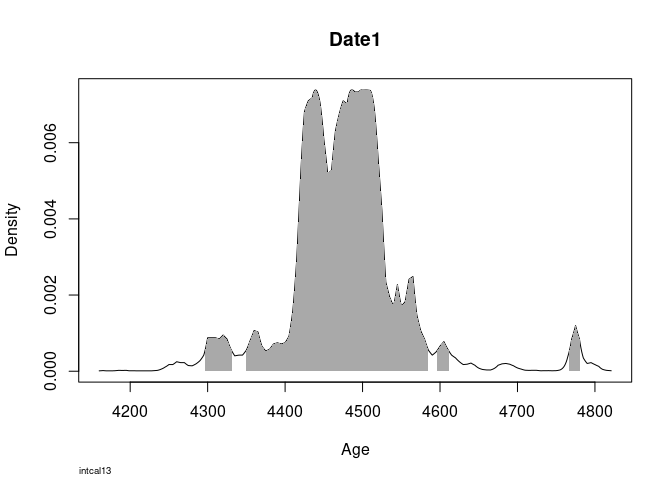
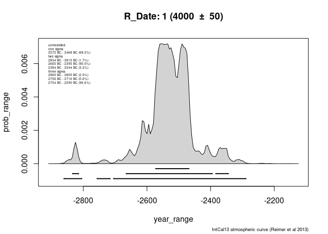

## Basic Calibration in R
### Available Options

* [ArchaeoPhases](https://cran.rstudio.com/web/packages/ArchaeoPhases/index.html)
  *  Marie-Anne Vibet
  * "Post-Processing of the Markov Chain Simulated by 'ChronoModel', 'Oxcal' or 'BCal'"
  * Not really for calibration itself, has to be done externally
* [ArchSeries](https://github.com/davidcorton/archSeries)
  *  David Orton
  * "Frequency time-series tools for archaeology"
  * No calibration options
  * Not on CRAN yet
* [Bchron](http://cran.rstudio.com/web/packages/Bchron/index.html)
  *  Andrew Parnell
  * "A Bayesian radiocarbon chronology model with R"
  * BchronCalibrate()
* [rcarbon](https://cran.r-project.org/web/packages/rcarbon/index.html)
  *  Andrew Bevan
  * "Calibration and Analysis of Radiocarbon Dates"
  * calibrate()
* [oxcAAR](https://cran.r-project.org/web/packages/oxcAAR/index.html)
  *  ISAAK
  * "Interface to 'OxCal' Radiocarbon Calibration"
  * oxcalCalibrate()
* Hand made (it is actually not that hard)
  * Basic
  * by means of matrix algebra (see [my blog post on basic calibration](http://martinhinz.info/jekyll/update/blog/2016/06/03/simple_calibration.html)) 
  * by means of bayesian statistics (see [my blog post on bayesian calibration](http://martinhinz.info/jekyll/update/blog/2017/01/23/bayesian_calibration.html))

Essentially it is Bchron, rcarbon and oxcAAR!

## Installing the packages with calibration option

So lets start with them and install them if necessary


```r
# A bit of magick
package_list <- c("Bchron", "rcarbon", "oxcAAR") # The packages we would like to have

for (package in package_list){ # for each in the list
  if( !is.element(package, .packages(all.available = TRUE)) ) { #check if it is not already installed
    install.packages(package) # if not, install it
  }
  library(package,character.only = TRUE) # load package
}
```

Luckily, all calibration functions are named differently, so there is no overwriting of the functions going on here. We can have all of them side by side.

## Just doing calibration

We might be eager to do our first calibration, so lets start immediatly. We need a 14C date for that, consisting of BP uncal and BP standard deviation:


```r
bp <- 4000
std <- 25
```

With that at hand, we can start calibration:

### rcarbon

Here it is straight forward, just plug in your date and let it run


```r
calDate.rcarbon <- calibrate(bp,std)
```

```
## [1] "Done."
```

```r
str(calDate.rcarbon)
```

```
## List of 3
##  $ metadata :'data.frame':	1 obs. of  11 variables:
##   ..$ DateID    : chr "1"
##   ..$ CRA       : num 4000
##   ..$ Error     : num 25
##   ..$ Details   : logi NA
##   ..$ CalCurve  : chr "intcal13"
##   ..$ ResOffsets: num 0
##   ..$ ResErrors : num 0
##   ..$ StartBP   : num 50000
##   ..$ EndBP     : num 0
##   ..$ Normalised: logi TRUE
##   ..$ CalEPS    : num 1e-05
##  $ grids    :List of 1
##   ..$ 1:Classes 'calGrid' and 'data.frame':	223 obs. of  2 variables:
##   .. ..$ calBP : num [1:223] 4779 4778 4777 4776 4775 ...
##   .. ..$ PrDens: num [1:223] 1.19e-05 1.51e-05 1.91e-05 2.40e-05 3.02e-05 ...
##  $ calmatrix: logi NA
##  - attr(*, "class")= chr [1:2] "CalDates" "list"
```

The result is a list containing
 * $metadata: The metadata for the (uncalibrated) date
 * $grids: The actual calibrated probabilities
 * $calmatrix: A matrix of probability values, one row per calendar year in timeRange and one column per date. Just a different format of $grids. This defaults to NA if not `calMatrix=TRUE` is specified in the call.

So let's plot it 

```r
plot(calDate.rcarbon)
```

<!-- -->

Nice and clean!

### Bchron

Again straight forward, specify BP, std and (here necessary, in rcarbon optional) the calibration curve


```r
calDate.Bchron <- BchronCalibrate(ages = bp, ageSds = std, calCurves = "intcal13")
str(calDate.Bchron)
```

```
## List of 1
##  $ Date1:List of 5
##   ..$ ages     : num 4000
##   ..$ ageSds   : num 25
##   ..$ calCurves: chr "intcal13"
##   ..$ ageGrid  : num [1:171] 4407 4408 4409 4410 4411 ...
##   ..$ densities: num [1:171] 1.25e-05 1.85e-05 2.73e-05 3.97e-05 6.44e-05 ...
##  - attr(*, "class")= chr "BchronCalibratedDates"
```

The result is a list containing
 * $ages: The uncalibrated date
 * $ageSds: The standard deviation of the uncalibrated date
 * $calCurves: The calibration curve used
 [We have specified this as input parameters]
 * $ageGrid: The calibrated BP (!) values
 * $densities: The calibrated probabilities

So let's plot it 


```r
plot(calDate.Bchron)
```

<!-- -->

Also nice, lacking the uncal probability and the calibration curve, but highlighting the 95% highest density region (2 sigma range).

### oxcAAR

oxcAAR needs a bit of extra love before it works. It relies on OxCal as calibration backend, so we have to install it first. Luckily there is a helper for doing that:


```r
quickSetupOxcal()
```

```
## Oxcal is installed but Oxcal executable path is wrong. Let's have a look...
```

```
## Oxcal path set!
```

```
## NULL
```

Oxcal is installed in your working directory, and the path to the executable is set. With that we might proceed to the calibration:


```r
calDate.oxcAAR <- oxcalCalibrate(bp, std)
str(calDate.oxcAAR)
```

```
## List of 1
##  $ 1:List of 6
##   ..$ name             : chr "1"
##   ..$ bp               : int 4000
##   ..$ std              : int 25
##   ..$ cal_curve        :List of 5
##   .. ..$ name      : chr " IntCal13 atmospheric curve (Reimer et al 2013)"
##   .. ..$ resolution: num 5
##   .. ..$ bp        : num [1:10001] 46401 46396 46391 46386 46381 ...
##   .. ..$ bc        : num [1:10001] -48050 -48044 -48040 -48034 -48030 ...
##   .. ..$ sigma     : num [1:10001] 274 274 274 273 273 ...
##   ..$ sigma_ranges     :List of 3
##   .. ..$ one_sigma  :'data.frame':	2 obs. of  3 variables:
##   .. .. ..$ start      : num [1:2] -2564 -2495
##   .. .. ..$ end        : num [1:2] -2522 -2478
##   .. .. ..$ probability: num [1:2] 48.6 19.6
##   .. ..$ two_sigma  :'data.frame':	1 obs. of  3 variables:
##   .. .. ..$ start      : num -2572
##   .. .. ..$ end        : num -2470
##   .. .. ..$ probability: num 95.4
##   .. ..$ three_sigma:'data.frame':	1 obs. of  3 variables:
##   .. .. ..$ start      : num -2618
##   .. .. ..$ end        : num -2460
##   .. .. ..$ probability: num 99.7
##   ..$ raw_probabilities:'data.frame':	118 obs. of  2 variables:
##   .. ..$ dates        : num [1:118] -2870 -2864 -2860 -2854 -2850 ...
##   .. ..$ probabilities: num [1:118] 0.00 0.00 0.00 2.41e-08 4.83e-08 ...
##   ..- attr(*, "class")= chr "oxcAARCalibratedDate"
##  - attr(*, "class")= chr [1:2] "list" "oxcAARCalibratedDatesList"
```

The resulting object is a bit more complicated. It is a list of calibrated dates (one each for each uncalibrated date inserted in the call), each containing

 * $name: A name for the date. If not given, a consecutive number.
 * $bp, $std: The uncalibrated date and its standard deviation
 [We have specified this as input parameters]
 * $cal_curve: The calibration curve used, with full parameterisation. Defaults to intcal13
 * $sigma_ranges: The sigma ranges for the calibrated date (1,2,3 sigma)
 * $raw_probabilities: a data frame containing the BC (!) dates and the calibrated probabilities

Again, let's plot it 


```r
plot(calDate.oxcAAR)
```

<!-- -->

Sigma ranges, probabilities, everything is in there.

Want a calibration curve?


```r
calcurve_plot(calDate.oxcAAR)
```

<!-- -->
