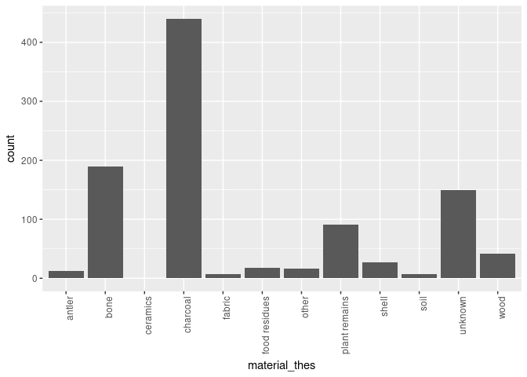

```r
library(tidyverse)
library(magrittr)
library(mapview)
library(sp)
library(sf)
# might be necessary to detach rcarbon first due to 'calibrate()' function
# detach('package:rcarbon')
library(c14bazAAR)
```

## c14bazAAR

c14bazAAR is a R package to download and prepare bulk c14 date collections.

### Why is this useful?

#### Radiocarbon dates

- c14 dates are fairly standardised (a pillar of stability in the Bad Data of archaeology)
- c14 dates have high resolution temporal and spatial information (they can be linked to all kind of data -- archaeology, climatology, genetics, linguistics...) 
- c14 dates are linked to distinct events in human history (they tell stories)

#### R package?

- User perspective
    - access many highly different databases with one interface
    - reproducibility with scripted data selection
    - standard data structures for direct access to powerful R tools (tidyverse)
- Developer perspective
    - Open Source: examine & improve the implementation and adjust everything for your needs
    - simple parser development framework to add further databases
    - embed bulk c14 dates into your own application

### Open Archives

- **14SEA** 14C database for Southeast Europe and Anatolia (10,000–3000 calBC).
- **aDRAC** Archives des datations radiocarbone d'Afrique centrale by Dirk Seidensticker.
- **AustArc** A Database of 14C and Luminescence Ages from Archaeological Sites in Australia by Alan N. Williams, Sean Ulm, Mike Smith, Jill Reid
- **CALPAL** Radiocarbon Database of the CalPal software package by Bernhard Weninger. See nevrome/CalPal-Database for an interface.
- **CONTEXT** Collection of radiocarbon dates from sites in the Near East and neighboring regions (20.000 - 5.000 calBC) by Utz Böhner and Daniel Schyle.
- **EUROEVOL** Cultural Evolution of Neolithic Europe Dataset by Katie Manning, Sue Colledge, Enrico Crema, Stephen Shennan and Adrian Timpson.
- **CARD Upload Template - KITE East Africa v2.1** Radiocarbon dates from eastern Africa in the CARD2.0 format by Colin Courtney Mustaphi, Rob Marchant
- **RADON** Central European and Scandinavian database of 14C dates for the Neolithic and Early Bronze Age by Dirk Raetzel-Fabian, Martin Furholt, Martin Hinz, Johannes Müller, Christoph Rinne, Karl-Göran Sjögren und Hans-Peter Wotzka.
- **RADON-B** Database for European 14C dates for the Bronze and Early Iron Age by Jutta Kneisel, Martin Hinz, Christoph Rinne.
- **...**

If you know more, add them in [this](https://github.com/ISAAKiel/c14bazAAR/issues/2) issue or join the development of c14bazAAR and start an own pull request.

### Let's get some data

c14bazAAR offers an individual parser function for every source database.


```r
c14bazAAR:::get_all_parser_functions()[1:2]
```

```
## [[1]]
## function (db_url = get_db_url("14SEA")) 
## {
##     check_if_packages_are_available("readxl")
##     check_connection_to_url(db_url)
##     tempo <- tempfile()
##     utils::download.file(db_url, tempo, mode = "wb", quiet = TRUE)
##     SEA14 <- tempo %>% readxl::read_xlsx(trim_ws = TRUE, na = c("Combination fails", 
##         "nd", "-"), col_types = c(Site = "text", Subregion = "text", 
##         `Subregion no.` = "skip", Country = "text", `Lab. no.` = "text", 
##         `Date BP` = "text", `±` = "text", δ13C = "text", `calBC 1σ (from)` = "skip", 
##         `calBC 1σ (to)` = "skip", Material = "text", Level = "text", 
##         Provenance = "text", Comment = "text", Period = "text", 
##         `Reference 1` = "text", `Reference 2` = "text", `Reference 3` = "text", 
##         `Reference 4` = "text")) %>% dplyr::transmute(labnr = .data[["Lab. no."]], 
##         c14age = .data[["Date BP"]], c14std = .[[6]], c13val = .[[7]], 
##         material = .data[["Material"]], country = .data[["Country"]], 
##         region = .data[["Subregion"]], site = .data[["Site"]], 
##         lat = NA, lon = NA, period = .data[["Period"]], feature = .data[["Provenance"]], 
##         shortref = {
##             combined_ref <- paste0(ifelse(!is.na(.data[["Reference 1"]]), 
##                 .data[["Reference 1"]], ""), ifelse(!is.na(.data[["Reference 1"]]) & 
##                 !is.na(.data[["Reference 2"]]), ", ", ""), ifelse(!is.na(.data[["Reference 2"]]), 
##                 .data[["Reference 2"]], ""), ifelse(!is.na(.data[["Reference 2"]]) & 
##                 !is.na(.data[["Reference 3"]]), ", ", ""), ifelse(!is.na(.data[["Reference 3"]]), 
##                 .data[["Reference 3"]], ""), ifelse(!is.na(.data[["Reference 3"]]) & 
##                 !is.na(.data[["Reference 4"]]), ", ", ""), ifelse(!is.na(.data[["Reference 4"]]), 
##                 .data[["Reference 4"]], ""))
##             ifelse(nchar(combined_ref) == 0, NA, combined_ref)
##         }, comment = .data[["Comment"]]) %>% dplyr::mutate(sourcedb = "14SEA") %>% 
##         as.c14_date_list()
##     unlink(tempo)
##     return(SEA14)
## }
## <environment: namespace:c14bazAAR>
## 
## [[2]]
## function (db_url = get_db_url("aDRAC")) 
## {
##     check_connection_to_url(db_url)
##     aDRAC <- db_url %>% readr::read_csv(trim_ws = TRUE, col_types = readr::cols(LABNR = readr::col_character(), 
##         C14AGE = readr::col_character(), C14STD = readr::col_character(), 
##         C13 = readr::col_character(), MATERIAL = readr::col_character(), 
##         SITE = readr::col_character(), COUNTRY = readr::col_character(), 
##         FEATURE = readr::col_character(), FEATURE_DESC = "_", 
##         LAT = readr::col_character(), LONG = readr::col_character(), 
##         SOURCE = readr::col_character())) %>% dplyr::transmute(labnr = .data[["LABNR"]], 
##         c14age = .data[["C14AGE"]], c14std = .data[["C14STD"]], 
##         c13val = .data[["C13"]], material = .data[["MATERIAL"]], 
##         site = .data[["SITE"]], country = .data[["COUNTRY"]], 
##         feature = .data[["FEATURE"]], lat = .data[["LAT"]], lon = .data[["LONG"]], 
##         shortref = .data[["SOURCE"]]) %>% dplyr::mutate(sourcedb = "aDRAC") %>% 
##         as.c14_date_list()
##     return(aDRAC)
## }
## <environment: namespace:c14bazAAR>
```

We can use one of them to download one specific collection.


```r
get_AustArch()
```

```
## Warning in evalq(as.integer(c14age), <environment>): NAs durch Umwandlung
## erzeugt
```

```
## Warning in evalq(as.integer(c14std), <environment>): NAs durch Umwandlung
## erzeugt
```

```
## Warning in evalq(as.double(lat), <environment>): NAs durch Umwandlung
## erzeugt
```

```
## Warning in evalq(as.double(lon), <environment>): NAs durch Umwandlung
## erzeugt
```

```
## 	Radiocarbon date list
## 	dates		5044
## 	sites		1743
## 	uncalBP		51700 ― 0 
## 
## # A tibble: 5,044 x 15
##    sourcedb method  labnr  c14age c14std c13val site    sitetype   feature
##    <chr>    <chr>   <chr>   <int>  <int>  <dbl> <chr>   <chr>      <chr>  
##  1 AustArch Radioc… ANU-1…   9430    150   NA   Wyrie … Aborigina… <NA>   
##  2 AustArch Radioc… GaK-1…    140     60   NA   Grafto… Aborigina… <NA>   
##  3 AustArch Radioc… Wk-26…    433     35  -26.1 Stocky… Artefact … <NA>   
##  4 AustArch Radioc… Beta-…  11730    430   NA   APC01 … Artefact … <NA>   
##  5 AustArch Radioc… OZF104   7910     40   NA   AWA 01… Artefact … <NA>   
##  6 AustArch Radioc… CAMS-…   4040     80   NA   Gunbil… Beeswax f… <NA>   
##  7 AustArch Radioc… CAMS-…   4460     80   NA   Gunbil… Beeswax f… <NA>   
##  8 AustArch Radioc… OZD-9…   3820     70   NA   Gunbil… Beeswax f… <NA>   
##  9 AustArch Radioc… GX-26…   2285    125   NA   Greenb… Burial     <NA>   
## 10 AustArch Radioc… Wk-63…    430     50   NA   Denham… Burial     Surface
## # ... with 5,034 more rows, and 6 more variables: material <chr>,
## #   region <chr>, lat <dbl>, lon <dbl>, shortref <chr>, comment <chr>
```

Or two or more to merge them afterwards. 


```r
adrac <- get_aDRAC()
radonb <- get_RADONB()

fuse(adrac, radonb)
```

```
## 	Radiocarbon date list
## 	dates		12213
## 	sites		3243
## 	countries	59
## 	uncalBP		80000 ― 0 
## 
## # A tibble: 12,213 x 16
##    sourcedb labnr    c14age c14std c13val site   feature material country
##    <chr>    <chr>     <int>  <int>  <dbl> <chr>  <chr>   <chr>    <chr>  
##  1 aDRAC    AA-78447   2362     39     0. Mbaere <NA>    <NA>     CAF    
##  2 aDRAC    AA-78448   2171     37     0. Mbaere <NA>    <NA>     CAF    
##  3 aDRAC    AA-78449    834     35     0. Mbaere <NA>    <NA>     CAF    
##  4 aDRAC    AA-94529    215     34     0. Ngotto BB01-29 <NA>     CAF    
##  5 aDRAC    AA-94530    168     35     0. Ngotto BB01-30 <NA>     CAF    
##  6 aDRAC    AA-94531    207     35     0. Ngotto BB01-31 <NA>     CAF    
##  7 aDRAC    AA-94532    148     34     0. Ngotto BB01-36 <NA>     CAF    
##  8 aDRAC    AA-94533    231     34     0. Ngotto BB05-32 <NA>     CAF    
##  9 aDRAC    AA-94534    187     34     0. Ngotto BB05-41 <NA>     CAF    
## 10 aDRAC    AA-94537    160     35     0. Ngotto ND01-03 <NA>     CAF    
## # ... with 12,203 more rows, and 7 more variables: lat <dbl>, lon <dbl>,
## #   shortref <chr>, sitetype <chr>, period <chr>, culture <chr>,
## #   species <chr>
```

We can even download all dates from all databases.


```r
all_dates <- get_all_dates()
```

```
## Trying to download all dates...
```

```
## Warning in evalq(as.integer(c14age), <environment>): NAs durch Umwandlung
## erzeugt
```

```
## Warning in evalq(as.integer(c14age), <environment>): NAs durch Umwandlung
## erzeugt
```

```
## Warning in evalq(as.integer(c14std), <environment>): NAs durch Umwandlung
## erzeugt
```

```
## Warning in evalq(as.double(lat), <environment>): NAs durch Umwandlung
## erzeugt
```

```
## Warning in evalq(as.double(lon), <environment>): NAs durch Umwandlung
## erzeugt
```

```
## Warning in evalq(as.double(c13val), <environment>): NAs durch Umwandlung
## erzeugt
```

### An own data structure: the c14_date_list

A c14_date_list is a modified tibble (which is a modified data.frame). It's a S3 class with a custom print function.


```r
class(all_dates)
```

```
## [1] "c14_date_list" "tbl_df"        "tbl"           "data.frame"
```

We can apply every operation to a c14_date_list that can also be applied to a data.frame, but most functions in c14bazAAR require a c14_date_list. If we apply functions that give back a data.frame or a tibble, then we lose the class tag. We'll see the consequences of this later.


```r
?c14_date_list
```

The c14_date_list has a defined set of variables (columns) that are arranged in a defined order. There's no explicit constructor function, but you can use `as.c14_date_list()` to create a c14_date_list from a data.frame or a tibble. `as.c14_date_list()` triggers `enforce_types()`, `order_variables()` and `c14bazAAR:::clean_latlon()`.


```r
candidate <- data.frame(
  c14std = c(30, "20"),
  country = c("Germany", "Austria"),
  c14age = c(3000, 2500),
  stringsAsFactors = F
)

as.c14_date_list(candidate)
```

```
## 	Radiocarbon date list
## 	dates		2
## 	countries	2
## 	uncalBP		3000 ― 2500 
## 
## # A tibble: 2 x 3
##   c14age c14std country
##    <int>  <int> <chr>  
## 1   3000     30 Germany
## 2   2500     20 Austria
```

The distinct set of variables and how they relate to the variables in the source databases are documented [here](https://github.com/ISAAKiel/c14bazAAR/blob/master/data-raw/variable_reference.csv). 


```r
variable_reference
```

```
## # A tibble: 74 x 13
##    c14bazAAR type  definition source `14SEA` ADRAC AUSTARCH CALPAL CONTEXT
##    <chr>     <chr> <chr>      <chr>  <chr>   <chr> <chr>    <chr>  <chr>  
##  1 sourcedb  char… Source da… c14ba… ""      ""    ""       ""     ""     
##  2 method    char… Radiocarb… datab… ""      ""    METHOD   METHOD ""     
##  3 labnr     char… Laborator… datab… Lab. n… LABNR LAB_CODE LABNR  LABNR  
##  4 c14age    inte… 14C age [… datab… Date BP C14A… AGE      C14AGE C14AGE 
##  5 c14std    inte… Standard … datab… ±       C14S… ERROR    C14STD C14STD 
##  6 calprobd… data… Probabili… c14ba… ""      ""    ""       ""     ""     
##  7 calrange  data… sigma ran… c14ba… ""      ""    ""       ""     ""     
##  8 sigma     doub… sigma val… c14ba… ""      ""    ""       ""     ""     
##  9 c13val    doub… Carbon-13… datab… δ13C    C13   C13_AGE  C13    C13    
## 10 site      char… Site name  datab… Site    SITE  SITE     SITE   SITE   
## # ... with 64 more rows, and 4 more variables: EUROEVOL <chr>,
## #   RADON <chr>, RADONB <chr>, KITEEASTAFRICA <chr>
```

### Enhance your c14_date_list: core functions of c14bazAAR

c14bazAAR 1.0.0 offers functions to cover four domains:

- calibration
- material classification
- fixing country names
- marking duplicates

All of these contain certain challenges, mostly caused by the low data quality of the source databases. 

#### calibration

The c14 age is not the correct absolute age of a date. To correct the age value we have to apply ^14^C calibration. c14bazAAR offers a method to individually calibrate all dates in a c14_date_list. The actual calibration is done by `Bchron::BchronCalibrate()`.


```r
dates_selection <- as.c14_date_list(all_dates[10000:10100,])

calibrate(dates_selection)
```

```
## Calibrating dates...
```


```r
dates_selection
```

```
## 	Radiocarbon date list
## 	dates		101
## 	sites		3
## 	countries	1
## 	uncalBP		11900 ― 1100 
## 
## # A tibble: 101 x 19
##    sourcedb method labnr   c14age c14std c13val site      sitetype feature
##    <chr>    <chr>  <chr>    <int>  <int>  <dbl> <chr>     <chr>    <chr>  
##  1 CALPAL   14C    OxA-64…   9360     75     0. Mont-sur… <NA>     <NA>   
##  2 CALPAL   14C    OxA-64…   9410     70     0. Mont-sur… <NA>     <NA>   
##  3 CALPAL   14C    OxA-64…   9015     80     0. Mont-sur… <NA>     <NA>   
##  4 CALPAL   14C    GrN-12…   8650     45     0. Moordena… <NA>     <NA>   
##  5 CALPAL   14C    GrN-12…   6530     30     0. Moordena… <NA>     <NA>   
##  6 CALPAL   14C    GrN-12…   6070    120     0. Moordena… <NA>     <NA>   
##  7 CALPAL   14C    Lv-1294   6270    120     0. Moordena… <NA>     <NA>   
##  8 CALPAL   14C    Lv-1295   6320    120     0. Moordena… <NA>     <NA>   
##  9 CALPAL   14C    Lv-1335   7990    110     0. Moordena… <NA>     <NA>   
## 10 CALPAL   14C    BM-289    4230    130     0. <NA>      <NA>     <NA>   
## # ... with 91 more rows, and 10 more variables: period <chr>,
## #   culture <chr>, material <chr>, species <chr>, region <chr>,
## #   country <chr>, lat <dbl>, lon <dbl>, shortref <chr>, comment <chr>
```

Unfortunately the result of calibration is per definition not a simple number but a probability distribution. To store this information in a data.frame in R we have to rely on list columns. 

`calibrate` provides two types of output: 

- calprobdistr: A full representation of the probability per year for all years above a certain threshold.     
- calrange: Only the age ranges of a defined sigma level.  


```r
calibrated <- calibrate(
  dates_selection,
  choices = c("calprobdistr", "calrange"),
  sigma = 2
)
```

```
## Calibrating dates...
```


```r
head(calibrated$calprobdistr[[1]])
```

```
##   calage      density
## 1  10224 1.031067e-06
## 2  10225 1.180100e-06
## 3  10226 1.414976e-06
## 4  10227 1.693953e-06
## 5  10228 2.024735e-06
## 6  10229 2.416244e-06
```

```r
head(calibrated$calrange)
```

```
## [[1]]
##   dens  from    to
## 1    3 10296 10359
## 2   92 10368 10755
## 
## [[2]]
##   dens  from    to
## 1  1.5 10424 10468
## 2 44.4 10478 10797
## 3  4.5 10852 10862
## 4 22.4 10958 11008
## 5 22.2 11017 11065
## 
## [[3]]
##   dens  from    to
## 1 56.2  9896 10302
## 2 38.6 10314 10387
## 
## [[4]]
##   dens from   to
## 1 94.5 9536 9694
## 
## [[5]]
##   dens from   to
## 1 92.4 7419 7490
## 
## [[6]]
##   dens from   to
## 1 95.2 6670 7245
```

The necessity for list columns makes working with this results more challenging. For example: How do we find the dates of a certain timeframe (4000 - 4500 calBP)?


```r
dates_4000_4500 <- calibrated %>%
  dplyr::select(labnr, calrange) %>%
  tidyr::unnest() %>%
  dplyr::filter(
    from >= 4000 & from <= 4500 |
      to >= 4000 & to <= 4500
  ) %$%
  labnr %>%
  unique

calibrated[calibrated$labnr %in% dates_4000_4500, ]
```

```
## # A tibble: 4 x 22
##   sourcedb method labnr  c14age c14std calprobdistr  calrange sigma c13val
##   <chr>    <chr>  <chr>   <int>  <int> <list>        <list>   <dbl>  <dbl>
## 1 CALPAL   14C    BM-289   4230    130 <data.frame … <data.f…    2.    0. 
## 2 CALPAL   14C    KIK-1…   3920     40 <data.frame … <data.f…    2.  -21.8
## 3 CALPAL   14C    KIK-1…   3690     40 <data.frame … <data.f…    2.  -22.6
## 4 CALPAL   14C    KIK-1…   4000     45 <data.frame … <data.f…    2.  -23.8
## # ... with 13 more variables: site <chr>, sitetype <chr>, feature <chr>,
## #   period <chr>, culture <chr>, material <chr>, species <chr>,
## #   region <chr>, country <chr>, lat <dbl>, lon <dbl>, shortref <chr>,
## #   comment <chr>
```

#### material classification

Almost all databases have information about the sample material, but the terminology isn't standardized (across and within databases). 


```r
calpal <- get_CalPal() %>% 
  dplyr::sample_n(1000) %>% 
  as.c14_date_list()

unique(calpal$material)
```

```
##  [1] "charcoal"          NA                  "seed"             
##  [4] "bone"              "wood"              "grain"            
##  [7] "food remains"      "eggshell"          "shell"            
## [10] "antler"            "ostrich egg"       "linen"            
## [13] "hazelnutshell"     "plant"             "textile"          
## [16] "bone (Bos taurus)" "Seed"              "plant remains"    
## [19] "seeds"             "mollusc"           "olive stone"      
## [22] "Charred twig"      "acorns"            "organic"          
## [25] "pottery"           "cloth"             "humic acid"       
## [28] "peat"              "soil"              "mat"              
## [31] "cereal"            "Br"                "reed"             
## [34] "fruit/seeds"       "food"              "bos"              
## [37] "Bone"              "hair"              "Ln"
```

```r
ggplot(calpal, aes(x = material)) +
  geom_bar() +
  theme(axis.text.x = element_text(angle = 90, hjust = 1))
```

<!-- -->

The c14bazAAR function `classify_material()` applies a manually curated thesaurus to unify certain termes to make data selection less tedious. 


```r
calpal_material <- classify_material(calpal)

ggplot(calpal_material, aes(x = material_thes)) +
  geom_bar() +
  theme(axis.text.x = element_text(angle = 90, hjust = 1))
```

<!-- -->

The thesaurus is prepared for all entries in all databases that are currently accessible with c14bazAAR. But as soon as new information is entered into the source databases or new source databases are added it needs servicing.


```r
material_thesaurus
```

```
## # A tibble: 977 x 2
##    cor    var                        
##    <chr>  <chr>                      
##  1 antler antler                     
##  2 antler horn                       
##  3 antler hjorthorn                  
##  4 antler Red deer antler            
##  5 antler Red deer modified antler   
##  6 antler Cervus elaphus, antler tool
##  7 antler Cervus elaphus, antler     
##  8 antler Red deer antler, tool      
##  9 antler Cervid antler              
## 10 antler Red deer, antler           
## # ... with 967 more rows
```

#### better country information

Selection by country is a valuable mean of filtering especially for dates without coordinates. Unfortunately the country information in the source databases is not very reliable and the country names are not standardized across (and sometimes even within) databases.

The consequence are wrong filtering results. That's especially annoying for the neolithicRC webapp.


```r
germany <- all_dates %>%
  dplyr::filter(country == "Germany") %>%
  dplyr::sample_n(100) %>%
  as.c14_date_list()
```


```r
germany %>% as.sf %>% mapview()
```

To fix this, we can apply a series of functions: `determine_country_by_coordinates()`, `standardize_country_name()` and `finalize_country_name()`.

##### country by coordinates

`determine_country_by_coordinates()` determines the country with a spatial join to a set of country polygons (`rworldxtra::countriesHigh`). Points that are not within a country polygon are matched to the closest one.


```r
utils::data("countriesHigh", package = "rworldxtra", envir = environment())

plot(countriesHigh)
```

<!-- -->

```r
germany <- germany %>% determine_country_by_coordinate()
```

```
## Determining country by coordinates...
```

```r
germany_coords <- germany %>%
  dplyr::filter(country_coord == "Germany") %>%
  as.c14_date_list()
```


```r
germany_coords %>% as.sf %>% mapview()
```

##### fixing country names

`standardize_country_name()` fixes country names by comparing the values in the country column to a general list of country identifiers (`countrycode::codelist`) and a small manually curated thesaurus for special cases. 


```r
head(countrycode::codelist[,c(5, 10, 20)])
```

```
##   country.name.en  ecb      fips.name
## 1     Afghanistan   AF    AFGHANISTAN
## 2   Åland Islands <NA>           <NA>
## 3         Albania   AL        ALBANIA
## 4         Algeria   DZ        ALGERIA
## 5  American Samoa   AS AMERICAN SAMOA
## 6         Andorra   AD        ANDORRA
```


```r
country_thesaurus
```

```
## # A tibble: 18 x 2
##    cor                              var                        
##    <chr>                            <chr>                      
##  1 Corsica                          Corsica                    
##  2 Crete                            Crete                      
##  3 Czech Republic                   Czech Republic             
##  4 Democratic Republic of the Congo COD                        
##  5 Ireland                          probably Ireland?          
##  6 Israel                           Israel, Palestine          
##  7 Israel                           Israel/Palestina           
##  8 Israel                           Israel/West Bank/Gaza Strip
##  9 Mallorca                         Mallorca                   
## 10 Republic of the Congo            COG                        
## 11 Sardinia                         Sardinia                   
## 12 Serbia                           Serbia and Montenegro      
## 13 Turkmenistan                     Turkmenia                  
## 14 United Arab Emirates             U.A.E.                     
## 15 United Kingdom                   England/Wales              
## 16 United Kingdom                   Great Britain              
## 17 United Kingdom                   Scotland                   
## 18 Yugoslavia                       SFRY
```


```r
adrac %>% 
  standardize_country_name() %>% 
  dplyr::select(country, country_thes) %>% 
  unique
```

```
## # A tibble: 12 x 2
##    country country_thes                    
##    <chr>   <chr>                           
##  1 CAF     Central African Republic        
##  2 GAB     Gabon                           
##  3 COG     Republic of the Congo           
##  4 COD     Democratic Republic of the Congo
##  5 RWA     Rwanda                          
##  6 CMR     Cameroon                        
##  7 TCD     Chad                            
##  8 GNQ     Equatorial Guinea               
##  9 GHA     Ghana                           
## 10 AGO     Angola                          
## 11 <NA>    <NA>                            
## 12 BDI     Burundi
```

`finalize_country_name()` calls both previous functions and selects a final country name with the following selection hierarchy: country_coord > country_thes > country.

#### marking and removing duplicates

Combining different source databases causes a lot of dates to appear more than once in the result selection. Also some databases already contain duplicates due to bad maintenance.


```r
duplicate_selection <- all_dates %>% dplyr::sample_n(5000)

duplicate_selection %>%
  dplyr::group_by(labnr) %>%
  dplyr::summarise(n = n()) %$% 
  table(n)
```

```
## n
##    1    2    5    9   23 
## 4649  157    1    1    1
```

`mark_duplicates` searches for duplicates in labnrs and marks duplicate groups.


```r
duplicate_selection <- duplicate_selection %>%
  as.c14_date_list() %>%
  mark_duplicates()
```

```
## Marking duplicates...
```

```
## -> Search for accordances in Lab Codes...
```

```
## -> Writing duplicate groups...
```


```r
duplicate_selection$duplicate_group %>% unique
```

```
##   [1]  NA   0   1   2   3   4   5   6   7   8   9  10  11  12  13  14  15
##  [18]  16  17  18  19  20  21  22  23  24  25  26  27  28  29  30  31  32
##  [35]  33  34  35  36  37  38  39  40  41  42  43  44  45  46  47  48  49
##  [52]  50  51  52  53  54  55  56  57  58  59  60  61  62  63  64  65  66
##  [69]  67  68  69  70  71  72  73  74  75  76  77  78  79  80  81  82  83
##  [86]  84  85  86  87  88  89  90  91  92  93  94  95  96  97  98  99 100
## [103] 101 102 103 104 105 106 107 108 109 110 111 112 113 114 115 116 117
## [120] 118 119 120 121 122 123 124 125 126 127 128 129 130 131 132 133 134
## [137] 135 136 137 138 139 140 141 142 143 144 145 146 147 148 149 150 151
## [154] 152 153 154 155 156 157 158
```

```r
duplicate_selection %>%
  dplyr::filter(duplicate_group == 30)
```

```
## # A tibble: 2 x 20
##   sourcedb method labnr c14age c14std c13val site  sitetype feature period
##   <chr>    <chr>  <chr>  <int>  <int>  <dbl> <chr> <chr>    <chr>   <chr> 
## 1 RADON    <NA>   GrA-…   4675     35  -30.7 Radd… enclosu… inner … <NA>  
## 2 EUROEVOL <NA>   GrA-…   4675     35   NA   Radd… <NA>     <NA>    UN    
## # ... with 10 more variables: culture <chr>, material <chr>,
## #   species <chr>, region <chr>, country <chr>, lat <dbl>, lon <dbl>,
## #   shortref <chr>, comment <chr>, duplicate_group <int>
```

Unfortunately there is no good way to merge dates automatically. Somebody has to check the information and make a decision for one entry or the other based on their research question.

c14bazAAR provides the function `remove_duplicates()` (aka "The annihilator"), but it removes also a lot of valuable information.


```r
duplicates_removed <- duplicate_selection %>% remove_duplicates()
```

```
## Removing duplicates...
```

```r
duplicates_removed %>% 
  dplyr::filter(duplicate_group == 30)
```

```
## # A tibble: 1 x 21
##   sourcedb method labnr c14age c14std c13val site  sitetype feature period
##   <chr>    <chr>  <chr>  <int>  <int>  <dbl> <chr> <chr>    <chr>   <chr> 
## 1 <NA>     <NA>   GrA-…   4675     35  -30.7 <NA>  enclosu… inner … UN    
## # ... with 11 more variables: culture <chr>, material <chr>,
## #   species <chr>, region <chr>, country <chr>, lat <dbl>, lon <dbl>,
## #   shortref <chr>, comment <chr>, duplicate_group <int>,
## #   duplicate_remove_log <chr>
```

```r
duplicates_removed %>% 
  dplyr::filter(duplicate_group == 30) %$%
  duplicate_remove_log
```

```
## [1] "sourcedb: RADON|EUROEVOL, method: NA, labnr: GrA-31190, c14age: 4675, c14std: 35, c13val: -30.7|NA, site: Raddon, Devon|Raddon, sitetype: enclosure|NA, feature: inner ditch, area B, ditch II, F576, context %73, from layer in mid fill of ditch, stratified above 574|NA, period: NA|UN, culture: Neolithikum|NA, material: miscellaneous|carbonised residue, species: small neolithic bowl sherd, with some internal residue|NA, region: NA, country: United Kingdom|Great Britain, lat: 50.816931|50.8212, lon: -3.58342|-0.744189, shortref: Albert & Schröter 1977|NA, comment: NA, duplicate_group: 30"
```

Another way to get a first understanding on the data without the duplicates is to just keep the first date in every duplicate group.


```r
duplicate_selection[!is.na(duplicate_selection$duplicate_group), ] %>%
  dplyr::group_by(duplicate_group) %>%
  dplyr::do(head(., n = 1)) %>% 
  dplyr::ungroup()
```

```
## # A tibble: 159 x 20
##    sourcedb method labnr  c14age c14std c13val site       sitetype feature
##    <chr>    <chr>  <chr>   <int>  <int>  <dbl> <chr>      <chr>    <chr>  
##  1 CALPAL   14C    Lu-15…   6710     70     0. Ageröd V   <NA>     <NA>   
##  2 RADON    <NA>   HAR-6…   3570    100    NA  Brenig     <NA>     <NA>   
##  3 EUROEVOL <NA>   GrN-2…   8020     50    NA  Groningen  <NA>     <NA>   
##  4 CALPAL   14C    Lu-845   3540     60     0. Hindby mo… <NA>     <NA>   
##  5 RADON    <NA>   Beta-…   5020    110    NA  Arene Can… <NA>     BB08 H 
##  6 RADON    <NA>   OxA-1…   9700    160    NA  Vale of P… <NA>     56     
##  7 CALPAL   14C    H-491…   5140    115     0. Heidmoor   <NA>     <NA>   
##  8 RADON    <NA>   GrA-2…   4965     40    NA  Whitehawk  <NA>     <NA>   
##  9 EUROEVOL <NA>   GrN-2…   6890     60    NA  Zwolle-Ha… <NA>     <NA>   
## 10 EUROEVOL <NA>   Gif-1…   3700    120    NA  La Chauss… <NA>     <NA>   
## # ... with 149 more rows, and 11 more variables: period <chr>,
## #   culture <chr>, material <chr>, species <chr>, region <chr>,
## #   country <chr>, lat <dbl>, lon <dbl>, shortref <chr>, comment <chr>,
## #   duplicate_group <int>
```

### Final challenge: Preparing a dataset (for Martin)


```r
#### download shapefile from Baden-Württemberg ####

# create a tempfile
temp <- tempfile()

# download archive with shapefile
utils::download.file(
  "https://www.lgl-bw.de/lgl-internet/web/sites/default/de/07_Produkte_und_Dienstleistungen/Open_Data_Initiative/Galerien/Dokumente/AX_Gebiet_Bundesland.zip", 
  temp, 
  quiet = TRUE
)

# unzip archive in tempdir
utils::unzip(
  temp,
  exdir = tempdir()
)

# read shapefile into R
bawue_sf <- st_read(file.path(tempdir(), "AX_Gebiet_Bundesland.shp"))

plot(bawue_sf$geometry)

#### prepare date dataset ####

# reduce date selection (to reduce calculation time)
sw_germany_dates_1 <- all_dates %>%
  dplyr::filter(lat < 50, lat > 47, lon < 11, lon > 7.5)
  
sw_germany_dates_2 <- sw_germany_dates_1 %>%
  as.c14_date_list() %>%
  classify_material() %>%
  dplyr::filter(material_thes != "charcoal", material_thes != "wood")

sw_germany_dates_3 <- sw_germany_dates_2 %>%
  as.c14_date_list() %>%
  determine_country_by_coordinate() %>%
  dplyr::filter(country_coord == "Germany")

sw_germany_dates_4 <- sw_germany_dates_3 %>%
  as.c14_date_list() %>%
  remove_duplicates()
  
# make c14_date_list a sf object and transform coordinates to ETRS89 / UTM zone 32N reference system
sw_germany_dates_sf <- sw_germany_dates_4 %>%
  as.c14_date_list()%>%
  as.sf %>%
  st_transform(crs = 25832)

plot(sw_germany_dates_sf$geom, add = TRUE, col = "black")

#### intersect shape with dates ####

# spatial intersection to find dates within Baden-Württemberg
bawue_dates_sf <- sw_germany_dates_sf %>%
  st_intersection(y = bawue_sf)

plot(bawue_dates_sf$geom, add = TRUE, col = "red")

# transform this sf file to a data.frame
bawue_dates <- bawue_dates_sf
st_geometry(bawue_dates) <- NULL
colnames(bawue_dates) <- gsub("data.", "", colnames(bawue_dates))

#### final selection by timeframe

# calibrate the dates in this selection
bawue_calibrated <- bawue_dates %>%
  as.c14_date_list() %>%
  calibrate(choices = "calprobdistr")

# select dates by timeframe
bawue_final <- bawue_calibrated %>%
  unnest() %>%
  dplyr::filter(
    calage > 2700, calage < 7500
  ) %>%
  dplyr::group_by(labnr) %>%
  dplyr::do(head(., n = 1)) %>% 
  dplyr::ungroup()

#saveRDS(bawue_final, file = "bawue_final.RDS")
```
