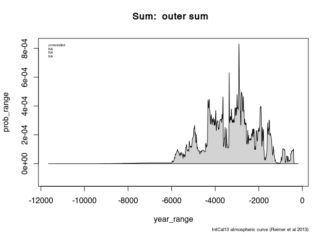
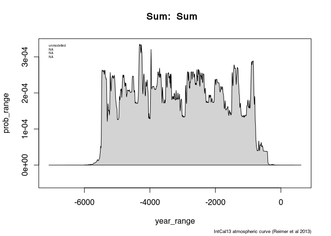
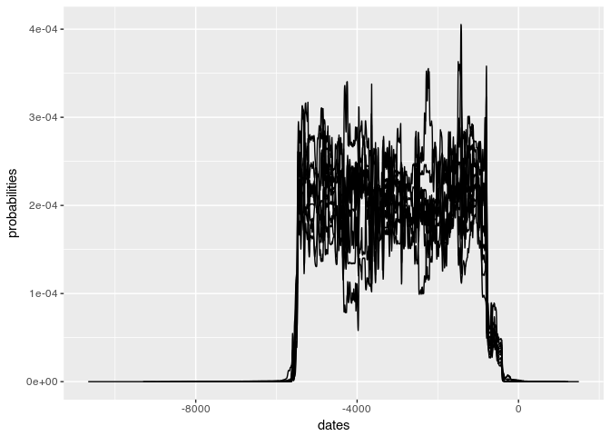
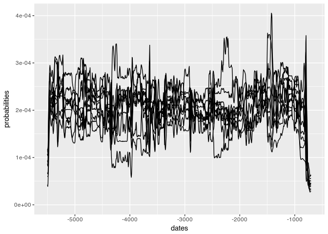

## Mass Operations on 14C Data

Having received the dates from the c14bazAAR, we might like to analyse the demographic development of Baden-Würtemberg between 7500 and 2700 cal BP (~ 5500–700 cal BC). For doing so, one first step might be to produce a sum calibration of those dates.


```r
library(dplyr)
```

```
## 
## Attaching package: 'dplyr'
```

```
## The following objects are masked from 'package:stats':
## 
##     filter, lag
```

```
## The following objects are masked from 'package:base':
## 
##     intersect, setdiff, setequal, union
```

```r
library(oxcAAR)
library(magrittr)
quickSetupOxcal()
```

```
## Oxcal doesn't seem to be installed. Downloading it now:
```

```
## Oxcal download to /tmp/RtmpKWUUgJ successful!
```

```
## Oxcal path set!
```

```
## NULL
```

```r
# Taking the output of the c14bazAAR and transform them into OxCal code.

bawue_final <- readRDS(file = "bawue_final.RDS")


bawue_dates_for_oxcaar <- R_Date(bawue_final$labnr,
                                 bawue_final$c14age,
                                 bawue_final$c14std) 

bawue_sum_code <- oxcal_Sum(bawue_dates_for_oxcaar) # Wrap it into a sum command
```

Looking to the beginning of that code:


```r
cat(substr(bawue_sum_code,1,253))
```

```
## Sum(" Sum "){
##  R_Date("B-936", 8140, 700);
## R_Date("Bln-167", 5200, 100);
## R_Date("Bln-54", 5140, 80);
## R_Date("Bln-70", 5240, 100);
## R_Date("Bln-71", 5200, 100);
## R_Date("Erl-110008", 3559, 57);
## R_Date("Erl-11010", 4615, 61);
## R_Date("Erl-11011", 4490, 58);
```

Looks like proper OxCal code. Than, lets use it for sum calibration


```r
my_result_data <- bawue_sum_code %>%
  executeOxcalScript() %>%
  readOxcalOutput() %>%
  parseOxcalOutput(only.R_Date = FALSE, first = TRUE)

str(my_result_data)
```

```
## List of 1
##  $  Sum :List of 9
##   ..$ name                   : chr " Sum "
##   ..$ type                   : chr "Sum"
##   ..$ bp                     : logi NA
##   ..$ std                    : logi NA
##   ..$ cal_curve              :List of 5
##   .. ..$ name      : chr " IntCal13 atmospheric curve (Reimer et al 2013)"
##   .. ..$ resolution: num 5
##   .. ..$ bp        : num [1:10001] 46401 46396 46391 46386 46381 ...
##   .. ..$ bc        : num [1:10001] -48050 -48044 -48040 -48034 -48030 ...
##   .. ..$ sigma     : num [1:10001] 274 274 274 273 273 ...
##   ..$ sigma_ranges           :List of 3
##   .. ..$ one_sigma  : logi NA
##   .. ..$ two_sigma  : logi NA
##   .. ..$ three_sigma: logi NA
##   ..$ raw_probabilities      :'data.frame':	2204 obs. of  2 variables:
##   .. ..$ dates        : num [1:2204] -11204 -11200 -11194 -11190 -11184 ...
##   .. ..$ probabilities: num [1:2204] 0.00 6.96e-10 6.96e-10 6.96e-10 6.96e-10 ...
##   ..$ posterior_sigma_ranges :List of 3
##   .. ..$ one_sigma  : logi NA
##   .. ..$ two_sigma  : logi NA
##   .. ..$ three_sigma: logi NA
##   ..$ posterior_probabilities: logi NA
##   ..- attr(*, "class")= chr "oxcAARCalibratedDate"
##  - attr(*, "class")= chr [1:2] "list" "oxcAARCalibratedDatesList"
```

So, we get back a object of oxcAARCalibratedDatesList with one entry, the sum. Lets plot that:


```r
plot(my_result_data)
```

<!-- -->

Nice wiggly and wobbly. But a lot of the peaks might come from individual sites, that received more attention or more money to make ^14^C dates. To cope with this, there is the technique called binning: Each site is weighted with 1, so gets the same influence in the final sum calibraton, regardless of how many ^14^C dates originally came from it. The assumption behind this is that all sites represent equal amount of activity (eg. people). This is questionable, if very heterogenous sites are considered. Best is to concentrate on one time interval and a comparable selection of sites (eg. only settlements). Lets see how it works:

## Binning

At first we have to produce 1 R_Date string (partly containing multiple dates) per site. Than we have to wrap each string into a sum command. Than we have to wrap the whole in a sum command, like above:


```r
# First, we add another column to our data, containing the R_Date string for that date:

bawue_final %<>% rowwise() %>%            # for each date (=row)
  mutate(oxcal_string = R_Date(labnr,     # add a column containing the R_Date code
                               c14age,
                               c14std)) %>%
  ungroup()                               # remove the rowwise grouping again

bawue_final %>% select(sourcedb,labnr,c14age, c14std, oxcal_string)
```

```
## # A tibble: 664 x 5
##    sourcedb labnr      c14age c14std oxcal_string                       
##    <chr>    <chr>       <int>  <int> <chr>                              
##  1 CALPAL   B-936        8140    700 "R_Date(\"B-936\", 8140, 700);"    
##  2 CALPAL   Bln-167      5200    100 "R_Date(\"Bln-167\", 5200, 100);"  
##  3 CALPAL   Bln-54       5140     80 "R_Date(\"Bln-54\", 5140, 80);"    
##  4 CALPAL   Bln-70       5240    100 "R_Date(\"Bln-70\", 5240, 100);"   
##  5 CALPAL   Bln-71       5200    100 "R_Date(\"Bln-71\", 5200, 100);"   
##  6 EUROEVOL Erl-110008   3559     57 "R_Date(\"Erl-110008\", 3559, 57);"
##  7 EUROEVOL Erl-11010    4615     61 "R_Date(\"Erl-11010\", 4615, 61);" 
##  8 EUROEVOL Erl-11011    4490     58 "R_Date(\"Erl-11011\", 4490, 58);" 
##  9 EUROEVOL Erl-11012    4297     59 "R_Date(\"Erl-11012\", 4297, 59);" 
## 10 EUROEVOL Erl-11013    4510     77 "R_Date(\"Erl-11013\", 4510, 77);" 
## # ... with 654 more rows
```

Now we have for all dates the generated r code in the dataset. Next step is to gather them per site:


```r
# Then we clue them together per site

site_sums <- bawue_final %>%       # Take the dates
  group_by(site) %>%               # per site do
  summarise(
    oxcal_string = paste(
      oxcal_string, 
      collapse = "\n")             # join the strings by a line break
  )
site_sums
```

```
## # A tibble: 119 x 2
##    site                         oxcal_string                              
##    <chr>                        <chr>                                     
##  1 Aichbühl                     "R_Date(\"Hd-7932-7999\", 5535, 45);\nR_D…
##  2 Aichtal-Grötzingen           "R_Date(\"Erl-12625\", 3673, 41);"        
##  3 Aldingen                     "R_Date(\"Hd-13664\", 3685, 40);\nR_Date(…
##  4 Allensbach-Kapplerfeld       "R_Date(\"Hd-10636-10617\", 5060, 60);\nR…
##  5 Allensbach-Lohhorn           "R_Date(\"Hd-19655\", 4175, 32);\nR_Date(…
##  6 Allensbach-Seeweg            "R_Date(\"Hd-19714\", 5054, 28);"         
##  7 Allensbach-Strandbad         "R_Date(\"Erl-11012\", 4297, 59);\nR_Date…
##  8 Alleshausen                  "R_Date(\"Hd-11751\", 4185, 45);\nR_Date(…
##  9 "Alleshausen \"Hartöschle\"" "R_Date(\"Hd-9507-9266\", 5700, 50);\nR_D…
## 10 Alleshausen, Grundwiesen     "R_Date(\"Hd-14821-15018\", 4086, 18);\nR…
## # ... with 109 more rows
```

Result is a data set with the site and the joined oxcal code for all the dates that belong to that site. Now we wrap each string per site into a sum, and the whole in a overarching sum command.


```r
bawue_sum_code <- site_sums %$%                               # finally take the strings
  oxcal_Sum(oxcal_string = oxcal_string, name = site) %>%     # wrap them in sum
  paste(collapse = "\n") %>%                                  # join the strings by line break
  oxcal_Sum(name = "outer sum")                               # wrap the whole thing in a sum

cat(substr(bawue_sum_code,1,253))
```

```
## Sum(" outer sum "){
##  Sum(" Aichbühl "){
##  R_Date("Hd-7932-7999", 5535, 45);
## R_Date("Hd-7933-8158", 5050, 35);
## R_Date("Hd-7934-8157", 5160, 35);
## R_Date("Hd-7935-8159", 6350, 55);
## R_Date("Hd-7936-8213", 3965, 30);
## R_Date("Hd-7937-8022", 5455, 50);
## R_Date("
```

Here we go. Now we have an outer sum, and inner sums per site. The rest is as above, we feed our code into OxCal and plot the result.


```r
my_result_data <- bawue_sum_code %>%
  executeOxcalScript() %>%
  readOxcalOutput() %>%
  parseOxcalOutput(only.R_Date = FALSE, first = TRUE)

plot(my_result_data)
```

<!-- -->

Definitely a different picture. But how much can we trust that pattern? Could it come just from the shape of the calibration curve, or from random effects from the date distribution? Lets find out using simulation!
 
## Using simulations to qualify sum calibration

For constructing confidence intervalls using Monte Carlo methods (simulations), we at first have to agree on the null hypothesis. The so called 'UCL approach' is to make a generalised linear regression of the data and use this (a kind of smooth general trend) as null model.

We make this somewhat easier, but nevertheless also very relevant given the appropriate research question: Does the distribution of the data deviate significantly from an uniform random distribution?

For that we need a uniform random distribution of our dates, and from that we simulate ^14^C dates.

In oxcAAR, there is a simple to use function to simulate a 14C sum. It is called `oxcalSumSim()`. 


```r
simsum <- oxcalSumSim(
  n = nrow(bawue_final),
  stds = sample(bawue_final$c14std),
  timeframe_begin = -5500,
  timeframe_end = -700,
  date_distribution = "uniform"
)

plot(simsum)
```

<!-- -->

Now we have kind of a background, which we can compare to our real world data. In an ideal world, the plot would be just a flat plateau, since we introduced uniform distributed original data. But due to random distribution effects and those of the calibration curve, there are still wiggles, indicating that there is some kind of variability going on. We might just compare to our real sum calibration:


```r
# for the sake of simplicity, we extract the raw probabilities of our result
my_sum_result <- my_result_data$` outer sum `$raw_probabilities

plot(
  my_sum_result$dates,
  my_sum_result$probabilities,
  type="l"
) # The reals world in solid line
lines(
  simsum$raw_probabilities$dates,
  simsum$raw_probabilities$probabilities,
  lty=2
  ) # The simulation in dashed line
```

<!-- -->

There are some wiggles of the real word data that are much higher than the simulated ones, some are much lower. There seems to be a pattern that differs from our hypothesis of a uniform distributed real world. But how significant is that. Have in mind, if I repeat the simulation, we get another, different result:


```r
simsum2 <- oxcalSumSim(
  n = nrow(bawue_final),
  stds = sample(bawue_final$c14std),
  timeframe_begin = -5500,
  timeframe_end = -700,
  date_distribution = "uniform"
)

plot(
  simsum$raw_probabilities$dates,
  simsum$raw_probabilities$probabilities,
  type="l",
  lty=2
  ) # The simulation in dashed line
lines(
  simsum2$raw_probabilities$dates,
  simsum2$raw_probabilities$probabilities,
  lty=3
  ) # The second simulation in dotted line
```

<!-- -->

These differences only come from the different distribution of the dates, and at second order, on the different position on the calibration curve. We can estimate the intensity of this effects, if we repeat the simulation several times. Lets say, for the sake of run time, we do that 10 times:


```r
library(broom)
library(ggplot2)

sim_result <- bawue_final %>% bootstrap(10) %>% do(
  oxcalSumSim(
    n = nrow(bawue_final),
    stds = sample(bawue_final$c14std),
    timeframe_begin = -5500,
    timeframe_end = -700,
    date_distribution = "uniform"
  )$raw_probabilities
)

ggplot() + geom_line(data=sim_result, aes(x=dates,y=probabilities,group=replicate))
```

<!-- -->

Lets zoom in abit


```r
time_window <- c(-5500, -700)

ggplot() + geom_line(data=sim_result, aes(x=dates,y=probabilities,group=replicate)) + xlim(time_window)
```

```
## Warning: Removed 8110 rows containing missing values (geom_path).
```

<!-- -->

Now we have some variety, and we can add our real world data to it to see whether or not its intensity is exceeding the simulation results:


```r
last_plot() + geom_line(data = my_sum_result, aes(x=dates,y=probabilities), color="red")
```

```
## Warning: Removed 8110 rows containing missing values (geom_path).
```

```
## Warning: Removed 1335 rows containing missing values (geom_path).
```

<!-- -->

Some ranges of the real world data definitively exceeds the random scatter of the simulation. But lets make that more standardised, and compute the 95% interval of the simulation. If the real world data goes beyond or below this range, than there is only a 5% chance that this could have occured by chance, making it statistically significant (of course for this you would rather go to 1000 repetitions of the simulation):


```r
alpha = .05

envelope <- sim_result %>% group_by(dates) %>% summarize(low=quantile(probabilities, alpha / 2),
                                         high=quantile(probabilities, 1 - alpha / 2))

ggplot() +
  geom_ribbon(data = envelope, aes(x=dates,ymin=low, ymax = high), alpha = .5) + 
  geom_line(data = my_sum_result, aes(x=dates,y=probabilities), color="red") + xlim(time_window)
```

```
## Warning: Removed 1335 rows containing missing values (geom_path).
```

<!-- -->

Now we get an idea. But there are still all this tiny wiggles, and most people (eg. Williams 2012) suggest using smoothing to get rid of them. We also do that! OxCal results come usually with a 5 years resolution, so if we apply a moving window average with a with of 10, we get a 50 years smoothing window.


```r
ma <- function(x,n=10){stats::filter(x,rep(1/n,n), sides=2)} # The smoothing function

my_sum_result %<>% mutate(probabilities_smoothed = ma(probabilities))

ggplot() +
  geom_ribbon(data = envelope, aes(x=dates,ymin=low, ymax = high), alpha = .5) + 
  geom_line(data = my_sum_result, aes(x=dates,y=probabilities), color="red") + 
  geom_line(data = my_sum_result, aes(x=dates,y=probabilities_smoothed), color="blue") + xlim(time_window)
```

```
## Warning: Removed 1335 rows containing missing values (geom_path).

## Warning: Removed 1335 rows containing missing values (geom_path).
```

<!-- -->

And also for the envelope:


```r
envelope %<>% mutate(low_smoothed = ma(low), high_smoothed = ma(high))

ggplot() +
  geom_ribbon(data = envelope, aes(x=dates,ymin=low_smoothed, ymax = high_smoothed), alpha = .5) + 
  geom_line(data = my_sum_result, aes(x=dates,y=probabilities_smoothed), color="blue") + xlim(time_window)
```

```
## Don't know how to automatically pick scale for object of type ts. Defaulting to continuous.
```

```
## Warning: Removed 1335 rows containing missing values (geom_path).
```

<!-- -->

Those that are brave might now repeat this with a little more simulation runs, lets say 1000 (takes approx. 1h, dependend on your computer):


```r
sim_result <- bawue_final %>% bootstrap(1000) %>% do(
  oxcalSumSim(
    n = nrow(bawue_final),
    stds = sample(bawue_final$c14std),
    timeframe_begin = -5500,
    timeframe_end = -700,
    date_distribution = "uniform"
  )$raw_probabilities
)

envelope <- sim_result %>% group_by(dates) %>% summarize(low=quantile(probabilities, alpha / 2),
                                         high=quantile(probabilities, 1 - alpha / 2))

my_sum_result %<>% mutate(probabilities_smoothed = ma(probabilities))

envelope %<>% mutate(low_smoothed = ma(low), high_smoothed = ma(high))

ggplot() +
  geom_ribbon(data = envelope, aes(x=dates,ymin=low_smoothed, ymax = high_smoothed), alpha = .5) + 
  geom_line(data = my_sum_result, aes(x=dates,y=probabilities_smoothed), color="blue") + xlim(time_window)
```

The result shows where the pattern in the real world curve can not be explained by the effects of random sample distribution or effects of the calibration curve. This does not mean that the result is correct: **Garbage in, Garbage out**! You still have to make sure (as sure as possible) that your sample is representative!
